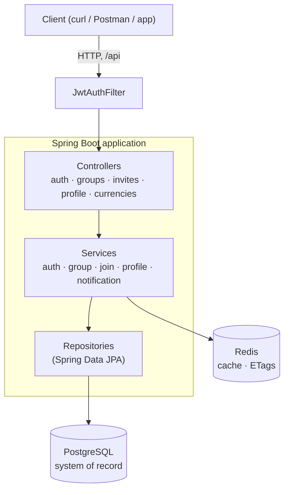

# vyay

> A Splitwise-style expense-splitting REST API, built with Spring Boot.


vyay is the backend for a shared-expenses app: people form groups, invite each other via links, split costs, and settle up. This repository is the API — a stateless, JWT-secured Spring Boot service backed by PostgreSQL and Redis. It is built as a portfolio project, with an emphasis on correct domain modelling, concurrency-safe operations, and clean layering.

---

## Highlights

- **Stateless JWT auth** with password and Google sign-in, email verification, and refresh tokens. Token payloads are modelled as a sealed `TokenClaims` type (access / refresh / email-verification / group-invite), so each token kind is type-checked rather than a loose claim bag.
- **Group & membership domain** with soft-delete and reactivation: leaving a group flips a row rather than deleting it, and rejoining revives the same row against a unique `(group_id, user_id)` constraint.
- **Invite links** in two flavours — a rotating **PRIMARY** link per group, and **TEMPORARY** links with expiry, a max-uses cap, and an optional allowlist of specific users.
- **Concurrency-safe counters**: invite use-caps and group member counts are incremented with atomic, guarded SQL `UPDATE`s, so simultaneous joins can't overshoot a cap or lose an increment.
- **ULIDs** as the public, API-exposed identifier (sortable, opaque), while internal numeric primary keys are never exposed.
- **Redis caching** with ETag / `304 Not Modified` support on reference data, plus per-cache TTLs.
- **Consistent contracts**: every response is wrapped in a uniform envelope, and failures flow through typed business exceptions to a central handler that maps them to the right status and error code.

---

## Tech stack

| Layer | Technology |
|---|---|
| Language / runtime | Java 17 |
| Framework | Spring Boot 3.5.4 (Web, Security, Data JPA, Validation) |
| Auth | JWT (jjwt), Spring Security |
| Database | PostgreSQL |
| Cache | Redis (Spring Data Redis) |
| IDs | ULID (`ulid-creator`) |
| API docs | springdoc-openapi 2.8.17 |
| Build | Maven (wrapper included) |

---

## Architecture

A conventional layered design — controllers handle HTTP, services own the business logic and transactions, repositories talk to the database — with PostgreSQL as the system of record and Redis as a cache.



**Domains:** `auth` (registration, login, verification, tokens), `user / profile`, `currency` & `language` (reference data), `group` (groups, memberships, invite links), and `invite / join`. A `BalanceLedger` domain for expenses and settlements is planned (see [Roadmap](#roadmap)).

---

## Key design decisions

The *why* behind the parts that aren't obvious:

- **ULID over UUID for public IDs.** ULIDs are lexicographically sortable (roughly time-ordered), which keeps index locality sane, while still being opaque. The internal `Long` primary key stays private.
- **Atomic guarded counters.** An invite's use-cap is enforced with a single `UPDATE ... SET use_count = use_count + 1 WHERE id = ? AND (max_uses IS NULL OR use_count < max_uses)`; a zero row-count *is* the "exhausted" signal. No read-then-check-then-write race, no row locking. Member counts increment the same way.
- **Soft-delete then reactivate.** A membership is never hard-deleted; status moves through `ACTIVE → LEFT / REMOVED`. Because `(group_id, user_id)` is unique, rejoining finds the existing row and flips it back to `ACTIVE` rather than inserting a duplicate.
- **Two invite-link types.** `PRIMARY` is the group's durable link (rotated on demand, no expiry); `TEMPORARY` links carry an expiry, a max-uses cap, and an optional allowlist (by user public ID, embedded in the invite JWT).
- **Money as integer minor units.** Monetary amounts are stored as `Long` (e.g. paise / cents), never floating point, with balances modelled per-user-per-group-per-currency.
- **Uniform response envelope + typed errors.** Controllers return a single wrapper shape; business rules throw typed exceptions (`InviteLinkExhaustedException`, `AlreadyAMemberException`, …) that a global handler maps to status + error code.
- **Idempotency keys** on mutating endpoints are planned, to make retries safe.

---

## Getting started

### Prerequisites

- JDK 17
- PostgreSQL (a database named `vyay`)
- Redis
- Maven is bundled via the wrapper (`./mvnw`), so no separate install needed

### Configuration

Settings live in `src/main/resources/application.yml`. The key entries:

| Setting | Purpose |
|---|---|
| `spring.datasource.*` | PostgreSQL URL / user / password |
| `spring.data.redis.*` | Redis host / port |
| `spring.jwt.secret` | HMAC signing secret for JWTs |
| `spring.mvc.servlet.path` | `/api` — every route is served under this prefix |
| `app.auth.skip-email-verification` | dev-only flag; when `true`, registrations are auto-verified |

> **Note:** the committed `application.yml` contains local development credentials and a JWT secret for convenience. For any real deployment, externalise these (environment variables or an ignored `application-local.yml`) and rotate the secret.

### Run

```bash
# macOS / Linux
./mvnw spring-boot:run

# Windows
mvnw.cmd spring-boot:run
```

The API comes up at `http://localhost:8080/api`.

---

## API documentation

OpenAPI 3 is generated automatically by springdoc. With the app running:

- **Spec (JSON):** `http://localhost:8080/api/v3/api-docs`
- **Spec (YAML):** `http://localhost:8080/api/v3/api-docs.yaml`

Import either into Postman or any OpenAPI tool for the full, always-current contract. A selection of the main routes:

| Method | Path | Description |
|---|---|---|
| `POST` | `/api/auth/register` | Register with email + password |
| `POST` | `/api/auth/login` | Log in, receive access + refresh tokens |
| `GET`  | `/api/auth/verify-and-login` | Verify email and log in (token in query) |
| `POST` | `/api/auth/refresh` | Exchange a refresh token |
| `POST` | `/api/groups` | Create a group |
| `GET`  | `/api/groups` | List the caller's groups (paginated) |
| `GET`  | `/api/groups/{groupId}` | Group detail (members, invites) |
| `POST` | `/api/groups/{groupId}/invites` | Create an invite link |
| `POST` | `/api/invites/join` | Join a group via an invite token |

Profile and currency endpoints live under `/api/profile` and `/api/currencies`.

---

## Development tooling & tests

A Node-based harness lives in `src/main/Scripts/` (zero dependencies — uses the Node 20+ built-in `fetch` and `node:test`). It runs against the live API, so start the server first with `app.auth.skip-email-verification: true`.

```bash
# Bulk-register test users into testDevUser.csv
node src/main/Scripts/addNewUser.js --numberOfUsers 100

# Provision a group filled to N members via its primary link
node src/main/Scripts/addGroupWithMembers.js --userNumber 1 --memberSize 30 --name "Demo" --type OTHER

# Run the assertion suite (POST /invites/join)
node --test src/main/Scripts/tests/
```

- `lib/` — a small shared layer: an HTTP client, fresh-data factories, and the seeded-user pool loader.
- `addNewUser.js` / `addGroupWithMembers.js` — populate a dev environment on demand.
- `tests/` — `node:test` assertions covering the join flow (happy path, already-member, exhausted, allowlist, inactive). Exits non-zero on failure, so it's CI-ready.

---

## Project structure

```
src/main/
├── java/com/vyay/core/
│   ├── common/utils/      # avatars, email, invite-code generation
│   ├── config/            # cache, password, datasource config
│   ├── controllers/       # REST endpoints
│   ├── dto/               # request / response / wrapper DTOs
│   ├── entity/            # JPA entities (user, group, reference)
│   ├── enums/             # roles, statuses, types
│   ├── exception/         # typed exceptions + global handler
│   ├── repository/        # Spring Data JPA repositories
│   ├── security/          # JWT service, filters, security config
│   └── services/          # business logic, grouped by domain
├── resources/
│   ├── application.yml
│   └── data.sql           # seeds currencies, languages, templates
└── Scripts/               # Node dev tooling & API tests
```

---

## Roadmap

**Done**
- Authentication: password + Google sign-in, email verification, refresh tokens
- User profiles and reference data (currencies, languages) with Redis caching
- Groups, memberships, and invite links (PRIMARY + TEMPORARY)
- Invite-join flow with allowlists, use-caps, and rejoin
- OpenAPI spec + Node test tooling and assertion suite

**Planned**
- `BalanceLedger`: expense creation and per-user-per-group-per-currency balances
- Leave / remove-member endpoints
- Idempotency keys on mutating endpoints
- Greedy debt-simplification for settle-up

---

## License

Released under the MIT License.